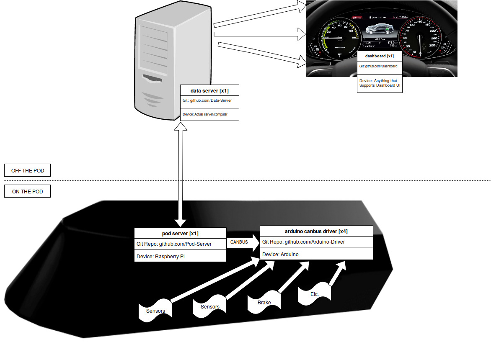

# General Information - How Everything Is Connected.

<!-- Urls to repositories so these can be linked to later. -->

[doc]: https://github.com/waterloop/docs
[goose2-embedded]: https://github.com/waterloop/goose2-embedded
[goose2-communication]: https://github.com/waterloop/goose2-communication
[goose2-dashboard]: https://github.com/waterloop/goose2-dashboard
[goose2-sensors]: https://github.com/waterloop/goose2-sensors
[goose2-data-processing]: https://github.com/waterloop/goose2-data-processing
[waterloop-legacy]: https://github.com/waterloop/waterloop-legacy
[team-manager-front]: https://github.com/waterloop/team-manager-front
[waterloop-website]: https://github.com/waterloop/waterloop-website
[team-manager-back]: https://github.com/waterloop/team-manager-back
[goose-communication]: https://github.com/waterloop/goose-communication
[goose3-sensors-old]: https://github.com/waterloop/goose3-sensors-old
[goose3-testing-tools]: https://github.com/waterloop/goose3-testing-tools
[wcosa]: https://github.com/waterloop/wcosa
[goose-sensors]: https://github.com/waterloop/goose-sensors
[wqt]: https://github.com/waterloop/wqt
[wcomms]: https://github.com/waterloop/wcomms
[goose-dashboard]: https://github.com/waterloop/goose-dashboard
[wcosa-test]: https://github.com/waterloop/wcosa-test
[wiki]: https://github.com/waterloop/wiki
[wstream]: https://github.com/waterloop/wstream
[wpool]: https://github.com/waterloop/wpool
[s18-software-challenge]: https://github.com/waterloop/s18-software-challenge
[goose-sensors-wio]: https://github.com/waterloop/goose-sensors-wio
[cosa-canbus-wio]: https://github.com/waterloop/cosa-canbus-wio
[cosa-roboteq-sdc21xx]: https://github.com/waterloop/cosa-roboteq-sdc21xx
[cosa-servo]: https://github.com/waterloop/cosa-servo
[cosa-i2c-register]: https://github.com/waterloop/cosa-i2c-register
[mpu6050]: https://github.com/waterloop/mpu6050
[waterloop]: https://github.com/waterloop/waterloop

### Current architechture.

* TODO: Every technical repository should be mapped onto the overall architechture.

### Repository Overview Table For Waterloop:

| Repository               | Pod/Server/Dashboard? | Is it Archived? |
| :----------------------: | :-------------------: | :-------------: |
| [goose-communication]    | YES                   | YES             |
| [goose-dashboard]        | YES                   | ??              |
| [goose-sensors-wio]      | YES                   | ??              |
| [goose-sensors]          | YES                   | YES             |
| [goose2-embedded]        | YES                   | YES             |
| [goose2-communication]   | YES                   | YES             |
| [goose2-dashboard]       | YES                   | YES             |
| [goose2-sensors]         | YES                   | YES             |
| [goose2-data-processing] | YES                   | YES             |
| [goose3-sensors-old]     | YES                   | YES             |
| [goose3-testing-tools]   | YES                   | YES             |
| [waterloop-legacy]       | ??                    | YES             |
| [wqt]                    | YES                   | YES             |
| [wcomms]                 | YES                   | ??              |
| [wstream]                | ??                    | ??              |
| [wpool]                  | ??                    | ??              |
| [wcosa]                  | YES                   | ??              |
| [cosa-canbus-wio]        | YES                   | ??              |
| [cosa-roboteq-sdc21xx]   | YES                   | ??              |
| [cosa-servo]             | YES                   | ??              |
| [cosa-i2c-register]      | ??                    | ??              |
| [mpu6050]                | ??                    | ??              |
| [doc]                    | NO                    | ??              |
| [team-manager-front]     | NO                    | ??              |
| [waterloop-website]      | NO                    | ??              |
| [wcosa-test]             | NO                    | YES             |
| [team-manager-back]      | NO                    | ??              |
| [wiki]                   | NO                    | ??              |
| [s18-software-challenge] | NO                    | YES             |
| [waterloop]              | NO                    | NO              |

